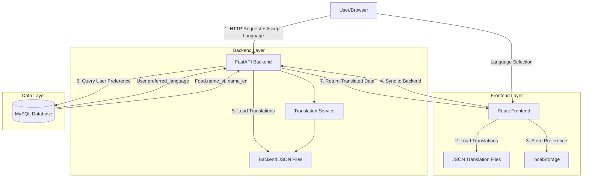
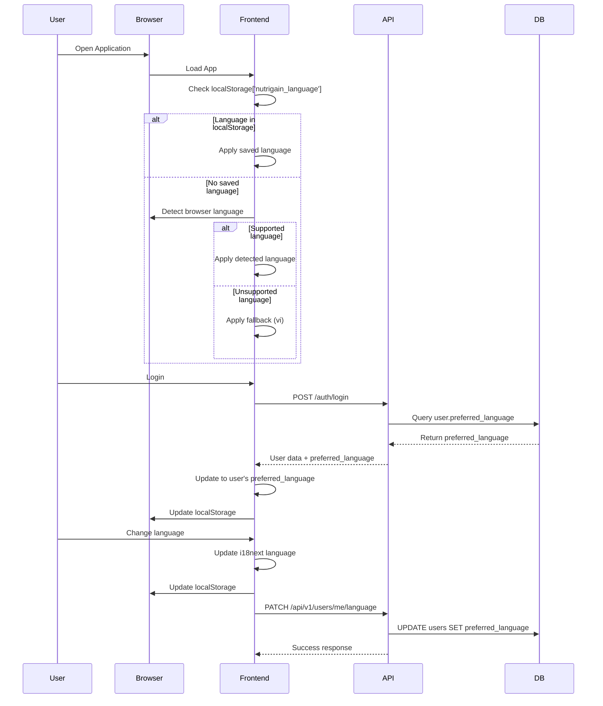
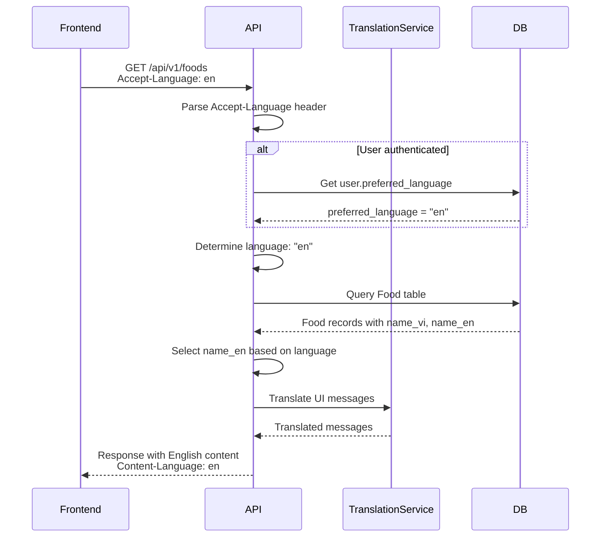

# Design Document: Multilingual Support (I18n)

## Overview

The multilingual support feature (internationalization/i18n) enables NutriGain to serve users in multiple languages, starting with Vietnamese (vi) and English (en). The system provides comprehensive language support across frontend UI, backend API responses, database content, and dynamic data translation.

### Key Components

1. **Frontend i18n System**: React-based UI translation using i18next library
2. **Backend Translation Service**: FastAPI service for dynamic content and API message translation
3. **Database Schema**: Extended schema supporting multilingual content storage
4. **Language Preference Management**: User-level language settings synchronized across devices
5. **Translation File Management**: Organized JSON-based translation resources

### Design Principles

- **User-Centric**: Language preference follows the user across devices and sessions
- **Performance-First**: Translations are cached in memory; language switching is instant
- **Fallback Safety**: Missing translations gracefully fall back to Vietnamese (default)
- **Maintainability**: Structured translation keys with clear naming conventions
- **Extensibility**: Architecture supports adding new languages with minimal code changes

### Technology Stack

**Frontend:**
- i18next: Core i18n framework
- react-i18next: React integration hooks
- i18next-browser-languagedetector: Automatic language detection

**Backend:**
- Python standard library (json module)
- Custom TranslationService class
- HTTP Accept-Language header parsing
- SQLAlchemy for database migrations

## Architecture

### System Architecture



### Language Resolution Flow



### Request/Response Translation Flow



## Components and Interfaces

### Frontend Components

#### 1. i18n Configuration (`src/frontend/src/i18n/config.js`)

**Purpose**: Initialize and configure i18next for the React application

**Key Configuration:**
```javascript
{
  resources: { vi: {...}, en: {...} },
  fallbackLng: 'vi',
  lng: localStorage.getItem('nutrigain_language') || 'vi',
  detection: {
    order: ['localStorage', 'navigator', 'htmlTag'],
    caches: ['localStorage'],
    lookupLocalStorage: 'nutrigain_language'
  }
}
```

**Responsibilities:**
- Load translation resources for all supported languages
- Configure language detection strategy
- Set fallback language
- Enable localStorage caching
- Disable React Suspense for immediate rendering

#### 2. LanguageSwitcher Component

**Interface:**
```typescript
interface LanguageSwitcherProps {
  variant?: 'full' | 'compact'; // full: card-style, compact: dropdown
  className?: string;
}
```

**Props:**
- `variant`: Display mode (full shows language cards, compact shows dropdown)
- `className`: Additional CSS classes

**Behavior:**
- Displays all supported languages with native names and flags
- Highlights currently selected language
- Changes language immediately on click (no page reload)
- Updates localStorage
- Syncs to backend for authenticated users

**Usage Locations:**
- Settings page (full variant)
- Header/navbar (compact variant)
- User profile menu (compact variant)

#### 3. Translation Hooks

**useTranslation Hook:**
```javascript
import { useTranslation } from 'react-i18next';

function Component() {
  const { t, i18n } = useTranslation();
  
  // Basic translation
  const text = t('common.save');
  
  // With interpolation
  const greeting = t('welcome.message', { name: 'User' });
  
  // Change language
  i18n.changeLanguage('en');
  
  return <div>{text}</div>;
}
```

### Backend Components

#### 1. TranslationService Class

**Location:** `app/services/translation_service.py`

**Interface:**
```python
class TranslationService:
    def __init__(self, translations_dir: str = "app/translations"):
        """Load all translation files into memory"""
        
    def get_translation(
        self, 
        key: str, 
        language: str = "vi", 
        **params
    ) -> str:
        """
        Get translated text for a key with parameter interpolation
        
        Args:
            key: Translation key (dot notation, e.g., "errors.auth.invalid")
            language: Language code (vi, en)
            **params: Parameters for string interpolation
            
        Returns:
            Translated string with params interpolated
            Falls back to key itself if translation not found
        """
        
    def get_supported_languages(self) -> list[str]:
        """Return list of supported language codes"""
        
    def reload_translations(self) -> None:
        """Reload translations from files (admin action)"""
```

**Translation File Structure:**
```
app/translations/
  ├── vi.json
  └── en.json
```

**Translation File Format:**
```json
{
  "errors": {
    "auth": {
      "invalid_credentials": "Email hoặc mật khẩu không đúng",
      "token_expired": "Phiên đăng nhập đã hết hạn"
    },
    "validation": {
      "required_field": "Trường {field} là bắt buộc",
      "invalid_email": "Email không hợp lệ"
    }
  },
  "api": {
    "success": {
      "profile_updated": "Cập nhật hồ sơ thành công",
      "language_changed": "Đã thay đổi ngôn ngữ sang {language}"
    }
  }
}
```

#### 2. Language Middleware/Dependency

**Location:** `app/api/dependencies.py`

**Interface:**
```python
async def get_user_language(
    request: Request,
    current_user: User | None = Depends(get_current_user_optional)
) -> str:
    """
    Determine the language for the current request
    
    Resolution order:
    1. Accept-Language header
    2. User's preferred_language (if authenticated)
    3. Fallback to 'vi'
    
    Returns:
        Language code (vi, en)
    """
```

**Usage in Routes:**
```python
@router.get("/foods")
async def get_foods(
    language: str = Depends(get_user_language),
    db: Session = Depends(get_db)
):
    # Use language to return translated content
    pass
```

#### 3. API Endpoints

**Update User Language Preference:**
```python
@router.patch("/api/v1/users/me/language")
async def update_user_language(
    language_update: LanguageUpdateSchema,
    current_user: User = Depends(get_current_user),
    db: Session = Depends(get_db),
    translation_service: TranslationService = Depends(get_translation_service)
):
    """
    Update user's preferred language
    
    Request Body:
        {
          "language": "en"
        }
    
    Response:
        {
          "success": true,
          "message": "Language updated successfully",
          "language": "en"
        }
    
    Errors:
        400: Unsupported language code
        401: Unauthorized
    """
```

### Data Models

#### 1. User Profile Extension

**Modified Entity:**
```python
class User(Base):
    __tablename__ = "users"
    
    # ... existing fields ...
    
    preferred_language: Mapped[str | None] = mapped_column(
        String(10), 
        nullable=True,
        default=None,
        index=True  # For query performance
    )
```

**Constraints:**
- VARCHAR(10) to support language codes like "vi", "en", "en-US"
- Nullable to allow users who haven't set preference
- Indexed for efficient filtering

#### 2. Food Entity Extension

**Modified Entity:**
```python
class Food(Base):
    __tablename__ = "foods"
    
    # Existing Vietnamese name
    name_vi: Mapped[str | None] = mapped_column(Text, nullable=True)
    
    # New English name
    name_en: Mapped[str | None] = mapped_column(Text, nullable=True)
    
    # ... other fields ...
```

**Translation Strategy:**
- Each translatable field has language-specific columns (name_vi, name_en)
- API selects appropriate column based on requested language
- Falls back to name_vi if translation missing

#### 3. Pydantic Schemas

**Request Schema:**
```python
class LanguageUpdateSchema(BaseModel):
    language: str = Field(..., pattern="^(vi|en)$")
    
    @validator('language')
    def validate_supported_language(cls, v):
        if v not in ['vi', 'en']:
            raise ValueError('Unsupported language code')
        return v
```

**Response Schemas:**
```python
class FoodItemView(BaseModel):
    food_id: str
    name: str  # Translated based on request language
    calories: float
    protein: float
    # ... other fields
    
    @classmethod
    def from_entity(cls, food: Food, language: str = "vi"):
        """Convert Food entity to view with language-specific name"""
        name = food.name_en if language == "en" else food.name_vi
        return cls(
            food_id=food.food_id,
            name=name or food.name_vi,  # Fallback
            # ... other fields
        )
```

## Data Models

### Database Schema Changes

#### Migration: Add Language Support

**Migration File:** `app/core/migrations.py` or Alembic migration

**Changes:**

1. **Users Table - Add preferred_language column:**
```sql
ALTER TABLE users 
ADD COLUMN preferred_language VARCHAR(10) NULL DEFAULT NULL;

CREATE INDEX idx_users_preferred_language 
ON users(preferred_language);
```

2. **Foods Table - Add English translations:**
```sql
ALTER TABLE foods 
ADD COLUMN name_en TEXT NULL;

-- Populate with initial translations (can be NULL initially)
-- Translation can be done gradually or via batch script
```

3. **Rollback Plan:**
```sql
-- To rollback:
ALTER TABLE users DROP COLUMN preferred_language;
ALTER TABLE foods DROP COLUMN name_en;
```

### Translation Data Flow

**Static Content (UI Labels):**
- Stored in: JSON files (`locales/vi.json`, `locales/en.json`)
- Loaded at: Application startup (frontend and backend)
- Accessed via: `t('key')` (frontend), `translation_service.get_translation('key')` (backend)

**Dynamic Content (Database Records):**
- Stored in: Database columns (name_vi, name_en)
- Loaded at: Query time
- Selected based on: User's language preference or Accept-Language header

**User Preferences:**
- Stored in: `users.preferred_language` + `localStorage['nutrigain_language']`
- Precedence: User DB preference > localStorage > Browser language > Fallback


## Correctness Properties

**Note on Property-Based Testing Applicability:**

This feature involves significant Infrastructure as Code (i18n configuration), UI rendering, configuration management, and integration work. Many of the requirements are better suited for example-based unit tests, integration tests, and smoke tests rather than property-based testing.

However, there are several core behaviors that exhibit universal properties suitable for PBT:

1. **Translation lookup and fallback mechanisms**
2. **Parameter interpolation**
3. **Language resolution logic**
4. **Data field selection based on language**

The properties below focus on these universal behaviors that should hold across all valid inputs.

---

*A property is a characteristic or behavior that should hold true across all valid executions of a system-essentially, a formal statement about what the system should do. Properties serve as the bridge between human-readable specifications and machine-verifiable correctness guarantees.*

### Reflection and Consolidation

After analyzing all acceptance criteria, I identified the following core universal properties. Several similar properties were consolidated:

- **Language fallback properties** (1.4, 1.10, 4.4, 6.9) → Combined into Property 1
- **localStorage persistence** (1.5, 2.6) → Combined into Property 2
- **API language update** (3.3, 3.9) → Combined into Property 3
- **Food name selection** (4.3, 4.4) → Combined into Property 4
- **Translation service lookup** (5.4, 5.5, 5.6) → Combined into Properties 5, 6, 7
- **Accept-Language parsing** (6.2, 6.3) → Combined into Property 8
- **Date/time/number formatting** (9.1, 9.2, 9.3, 9.4, 9.6, 9.7) → Combined into Property 9
- **Translation validation** (10.3, 10.7) → Combined into Property 10

### Property 1: Unsupported Language Fallback

*For any* unsupported language code, when that language is requested, the system SHALL return content in the fallback language (Vietnamese - 'vi') and SHALL NOT fail or return empty content.

**Validates: Requirements 1.4, 1.10, 4.4, 6.9**

### Property 2: Language Preference Persistence Round-Trip

*For any* valid supported language code ('vi' or 'en'), when the user sets that language preference, the system SHALL store it in localStorage with key "nutrigain_language", and upon reloading the application, the system SHALL restore and apply that same language preference.

**Validates: Requirements 1.5, 1.6, 2.6**

### Property 3: API Language Update Validation

*For any* language code submitted to the PATCH /api/v1/users/me/language endpoint:
- IF the code is supported ('vi' or 'en'), the system SHALL accept it and update the user's preferred_language field to that value
- IF the code is unsupported, the system SHALL reject it with a 400 Bad Request error and the message "Unsupported language code"

**Validates: Requirements 3.3, 3.8, 3.9**

### Property 4: Food Name Language Selection with Fallback

*For any* Food entity and any requested language:
- IF the food has a translation for the requested language (name_en for 'en', name_vi for 'vi'), the system SHALL return that translated name
- IF the translation is missing (NULL or empty), the system SHALL return the Vietnamese name (name_vi) as fallback
- The system SHALL NOT return NULL or empty string when at least one name field exists

**Validates: Requirements 4.3, 4.4**

### Property 5: Translation Service Parameter Interpolation

*For any* translation key containing parameter placeholders (e.g., "{name}", "{count}") and any set of parameter values, the TranslationService.get_translation() method SHALL replace all placeholders with the provided parameter values and return a string with all placeholders correctly substituted.

**Validates: Requirements 5.4**

### Property 6: Translation Service Missing Key Fallback

*For any* translation key that does not exist in the translation files, the TranslationService.get_translation() method SHALL return the key itself as a string (not NULL, not empty, not an error).

**Validates: Requirements 5.5**

### Property 7: Translation Service Nested Key Navigation

*For any* valid nested translation key using dot notation (e.g., "errors.auth.invalid", "dashboard.meals.breakfast"), the TranslationService SHALL correctly navigate the nested JSON structure and return the value at that path, regardless of nesting depth (up to reasonable limits like 10 levels).

**Validates: Requirements 5.6**

### Property 8: Accept-Language Header Parsing with Priority

*For any* Accept-Language header containing one or more language codes (with or without quality values):
- The system SHALL parse the header and extract all language codes
- IF multiple languages are present, the system SHALL select the first supported language in priority order
- IF no supported language is found, the system SHALL use the fallback language ('vi')
- The system SHALL NOT fail on malformed headers

**Validates: Requirements 6.2, 6.3**

### Property 9: Locale-Specific Formatting Consistency

*For any* date, time, or number value and any supported locale:
- Date formatting SHALL be consistent with the locale's conventions (dd/MM/yyyy for 'vi', MM/dd/yyyy for 'en')
- Time formatting SHALL be consistent with the locale's conventions (24-hour for 'vi', 12-hour AM/PM for 'en')
- Number formatting SHALL use locale-appropriate separators (thousands and decimal)
- Relative time strings SHALL be translated to the appropriate language
- The formatted output SHALL always be a valid, parseable string in that locale's format

**Validates: Requirements 9.1, 9.2, 9.3, 9.4, 9.6, 9.7**

### Property 10: Translation Completeness Validation

*For any* translation key present in at least one language file:
- The validation script SHALL detect if that key is missing in any other supported language file
- The validation script SHALL detect if any key is duplicated within the same language file
- The validation script SHALL report all missing and duplicate keys in the output
- The script SHALL NOT fail to complete due to missing/duplicate keys (non-blocking validation)

**Validates: Requirements 10.3, 10.7**

### Property 11: Enum Translation Consistency

*For any* enumerated value (meal_type, meal_role, balance_status) and any supported language, the system SHALL provide a translation for that enum value, and the translation SHALL be consistent across all API endpoints that return that enum value.

**Validates: Requirements 4.6, 11.1, 11.4**

### Property 12: Content-Language Response Header

*For any* API request with a determined language (from Accept-Language header, user preference, or fallback), the API response SHALL include a "Content-Language" header with the ISO 639-1 language code that was actually used for the response content.

**Validates: Requirements 6.6**

### Property 13: Cross-Device Language Synchronization

*For any* authenticated user with a saved preferred_language in their profile, when that user logs in from any device or browser (without prior localStorage), the system SHALL apply their saved preferred_language from the database, overriding any browser language detection.

**Validates: Requirements 3.6**

## Error Handling

### Frontend Error Handling

**Missing Translation Keys:**
- Behavior: Display the key itself in red text (development mode) or fallback language (production)
- Logging: Console warning with missing key and current language
- User Impact: Minimal - fallback text is shown

**Language Switching Failures:**
- Scenario: Network error when syncing to backend
- Behavior: Language changes locally (localStorage + UI) but retries API call in background
- User Notification: Toast message "Language updated locally, will sync when connection is restored"
- Recovery: Automatic retry on next API call

**Translation File Loading Errors:**
- Scenario: JSON parse error or network failure
- Behavior: Continue with default language (Vietnamese)
- Logging: Error logged to console and error tracking service
- User Impact: App remains functional with default language

### Backend Error Handling

**Invalid Language Code:**
- HTTP Status: 400 Bad Request
- Error Response:
```json
{
  "detail": {
    "message": "Unsupported language code",
    "supported_languages": ["vi", "en"],
    "received": "fr"
  }
}
```

**Database Query Errors:**
- Scenario: Unable to fetch user's preferred_language
- Behavior: Fall back to Accept-Language header or default language
- Logging: Error logged with user ID and stack trace
- User Impact: Minimal - fallback language is used

**Translation Service Errors:**
- Scenario: Translation file not found or corrupted
- Behavior: Return key as fallback, log error
- Recovery: Admin can reload translations via admin endpoint
- User Impact: Some untranslated text, but app remains functional

**Accept-Language Parsing Errors:**
- Scenario: Malformed Accept-Language header
- Behavior: Gracefully handle and fall back to default language
- Logging: Warning logged with malformed header value
- User Impact: None - default language is used

### Database Migration Error Handling

**Migration Failures:**
- Rollback: Automatic rollback on any migration error
- Logging: Full error details logged including SQL statement
- Recovery: Manual intervention required; rollback migration provided
- Data Safety: No data loss due to transaction-based migrations

**Missing Translation Data:**
- Scenario: name_en is NULL for some foods
- Behavior: API returns name_vi as fallback
- User Experience: Seamless - Vietnamese name is shown
- Resolution: Admin can populate translations via admin interface

## Testing Strategy

### Overview

This feature requires a **hybrid testing approach** combining:

1. **Property-Based Tests (PBT)** - For universal behaviors (translation lookup, fallback, formatting)
2. **Unit Tests** - For specific scenarios (component rendering, configuration)
3. **Integration Tests** - For end-to-end flows (API language resolution, database queries)
4. **Smoke Tests** - For infrastructure (migrations, file organization)
5. **Visual Regression Tests** - For UI language switching

### Property-Based Testing (Frontend)

**Library:** fast-check (already in package.json)

**Test Files:**
- `src/frontend/src/i18n/__tests__/i18n.property.test.js`
- `src/frontend/src/utils/__tests__/formatting.property.test.js`

**Property Tests:**

**PT-1: localStorage Persistence Round-Trip (Property 2)**
```javascript
import fc from 'fast-check';
import { test, expect } from 'vitest';
import i18n from '../config';

test('Property 2: Language preference localStorage round-trip', () => {
  fc.assert(
    fc.property(
      fc.constantFrom('vi', 'en'), // Valid language codes
      (language) => {
        // Set language
        i18n.changeLanguage(language);
        
        // Check localStorage
        const stored = localStorage.getItem('nutrigain_language');
        expect(stored).toBe(language);
        
        // Simulate reload: read from localStorage and apply
        const restored = localStorage.getItem('nutrigain_language');
        i18n.changeLanguage(restored);
        
        // Verify language is restored
        expect(i18n.language).toBe(language);
      }
    ),
    { numRuns: 100 }
  );
});
```

**PT-2: Unsupported Language Fallback (Property 1)**
```javascript
test('Property 1: Unsupported language fallback', () => {
  fc.assert(
    fc.property(
      fc.string({ minLength: 2, maxLength: 5 })
        .filter(code => code !== 'vi' && code !== 'en'), // Unsupported codes
      (unsupportedLang) => {
        i18n.changeLanguage(unsupportedLang);
        
        // Should fallback to 'vi'
        expect(i18n.language).toBe('vi');
        
        // Should still return translated text, not errors
        const translation = i18n.t('common.save');
        expect(translation).toBeTruthy();
        expect(translation).not.toBe('');
      }
    ),
    { numRuns: 100 }
  );
});
```

**PT-3: Date/Time Formatting Consistency (Property 9)**
```javascript
test('Property 9: Locale-specific date formatting', () => {
  fc.assert(
    fc.property(
      fc.date(),
      fc.constantFrom('vi', 'en'),
      (date, locale) => {
        const formatted = formatDate(date, locale);
        
        // Verify format pattern matches locale
        if (locale === 'vi') {
          // dd/MM/yyyy pattern
          expect(formatted).toMatch(/^\d{2}\/\d{2}\/\d{4}$/);
        } else {
          // MM/dd/yyyy pattern
          expect(formatted).toMatch(/^\d{2}\/\d{2}\/\d{4}$/);
        }
        
        // Verify parseable back to original date
        const parsed = parseDate(formatted, locale);
        expect(parsed.toDateString()).toBe(date.toDateString());
      }
    ),
    { numRuns: 100 }
  );
});
```

### Property-Based Testing (Backend)

**Library:** Hypothesis (Python property-based testing)

**Installation:** `pip install hypothesis`

**Test Files:**
- `tests/services/test_translation_service_properties.py`
- `tests/api/test_language_resolution_properties.py`

**Property Tests:**

**PT-4: Translation Service Parameter Interpolation (Property 5)**
```python
from hypothesis import given, strategies as st
import pytest
from app.services.translation_service import TranslationService

@given(
    st.dictionaries(
        keys=st.text(min_size=1, max_size=20, alphabet=st.characters(blacklist_characters='{}')),
        values=st.one_of(st.text(), st.integers(), st.floats(allow_nan=False))
    )
)
def test_property_5_parameter_interpolation(params):
    """Property 5: Parameter interpolation should replace all placeholders"""
    service = TranslationService()
    
    # Create a translation with placeholders matching params
    placeholders = ''.join([f"Hello {{{key}}}" for key in params.keys()])
    
    result = service.interpolate(placeholders, **params)
    
    # Verify no placeholders remain in output
    assert '{' not in result or '}' not in result
    
    # Verify all param values appear in result
    for value in params.values():
        assert str(value) in result

@given(st.text(min_size=1, max_size=100))
def test_property_6_missing_key_fallback(key):
    """Property 6: Missing keys should return the key itself"""
    service = TranslationService()
    
    # Generate a key that definitely doesn't exist
    nonexistent_key = f"nonexistent.{key}.{uuid.uuid4()}"
    
    result = service.get_translation(nonexistent_key, language="en")
    
    # Should return the key itself
    assert result == nonexistent_key
    assert result is not None
    assert result != ""
```

**PT-5: Accept-Language Header Parsing (Property 8)**
```python
@given(
    st.lists(
        st.tuples(
            st.sampled_from(['vi', 'en', 'fr', 'ja', 'de']),  # language codes
            st.floats(min_value=0.0, max_value=1.0)  # quality values
        ),
        min_size=1,
        max_size=5
    )
)
def test_property_8_accept_language_parsing(language_list):
    """Property 8: Accept-Language parsing should select first supported language"""
    from app.api.dependencies import parse_accept_language
    
    # Build Accept-Language header
    header_parts = [f"{lang};q={quality}" for lang, quality in language_list]
    header = ", ".join(header_parts)
    
    result = parse_accept_language(header, supported=['vi', 'en'])
    
    # Find first supported language in the list
    expected = next((lang for lang, _ in language_list if lang in ['vi', 'en']), 'vi')
    
    assert result == expected
    assert result in ['vi', 'en']  # Must be a supported language
```

**PT-6: Food Name Language Selection (Property 4)**
```python
@given(
    st.builds(
        Food,
        food_id=st.text(min_size=1),
        name_vi=st.one_of(st.none(), st.text(min_size=1)),
        name_en=st.one_of(st.none(), st.text(min_size=1))
    ).filter(lambda f: f.name_vi is not None or f.name_en is not None),  # At least one name
    st.sampled_from(['vi', 'en'])
)
def test_property_4_food_name_selection(food, language):
    """Property 4: Food name selection with fallback"""
    from app.views.schemas import FoodItemView
    
    view = FoodItemView.from_entity(food, language=language)
    
    # Should return a non-empty name
    assert view.name is not None
    assert view.name != ""
    
    # If requested language has translation, should use it
    if language == 'en' and food.name_en:
        assert view.name == food.name_en
    elif language == 'vi' and food.name_vi:
        assert view.name == food.name_vi
    else:
        # Otherwise, should fallback to name_vi
        assert view.name == (food.name_vi or food.name_en)
```

### Unit Tests

**Frontend Unit Tests:**
- LanguageSwitcher component rendering (variants, highlighting)
- i18n configuration loading
- Translation hook usage
- localStorage read/write

**Backend Unit Tests:**
- TranslationService initialization
- Language validation in Pydantic schemas
- API endpoint existence
- Database schema verification

**Example Unit Test:**
```javascript
// LanguageSwitcher.test.jsx
describe('LanguageSwitcher Component', () => {
  it('should render all supported languages', () => {
    const { getByText } = render(<LanguageSwitcher variant="full" />);
    
    expect(getByText('Tiếng Việt')).toBeInTheDocument();
    expect(getByText('English')).toBeInTheDocument();
  });
  
  it('should highlight current language', () => {
    i18n.changeLanguage('en');
    const { container } = render(<LanguageSwitcher variant="full" />);
    
    const englishOption = container.querySelector('[data-language="en"]');
    expect(englishOption).toHaveClass('active');
  });
});
```

### Integration Tests

**Frontend Integration Tests:**
- Login flow → Apply user's preferred_language
- Language switcher → Update localStorage + backend
- Component translation updates on language change

**Backend Integration Tests:**
- API endpoint with Accept-Language header → Correct language in response
- PATCH /api/v1/users/me/language → Update database
- Food query → Return correct name field based on language
- Meal plan generation → All items in correct language

**Example Integration Test:**
```python
def test_api_language_resolution(client, db_session, test_user):
    """Integration test: API respects Accept-Language header"""
    # Set user's preferred_language to 'vi'
    test_user.preferred_language = 'vi'
    db_session.commit()
    
    # Request with Accept-Language: en
    response = client.get(
        "/api/v1/foods",
        headers={"Accept-Language": "en", "Authorization": f"Bearer {token}"}
    )
    
    assert response.status_code == 200
    assert response.headers["Content-Language"] == "en"
    
    # Food names should be in English
    foods = response.json()
    for food in foods:
        # Verify English name is returned (or fallback if missing)
        assert "name" in food
        # If food has name_en, it should be used
        food_entity = db_session.query(Food).filter_by(food_id=food["food_id"]).first()
        if food_entity.name_en:
            assert food["name"] == food_entity.name_en
```

### Smoke Tests

**Infrastructure Checks:**
- Translation files exist in correct directories
- Database columns exist (preferred_language, name_en)
- Migration scripts exist and are reversible
- npm script `check:i18n` exists
- README documentation exists

**Example Smoke Test:**
```python
def test_translation_files_exist():
    """Smoke test: All translation files exist"""
    assert Path("app/translations/vi.json").exists()
    assert Path("app/translations/en.json").exists()
    
def test_database_schema():
    """Smoke test: Database has required columns"""
    inspector = inspect(engine)
    
    # Check User table
    user_columns = [c['name'] for c in inspector.get_columns('users')]
    assert 'preferred_language' in user_columns
    
    # Check Food table
    food_columns = [c['name'] for c in inspector.get_columns('foods')]
    assert 'name_vi' in food_columns
    assert 'name_en' in food_columns
```

### Visual Regression Tests

**Tool:** Playwright or Cypress with visual snapshots

**Test Cases:**
- Dashboard in Vietnamese vs English (layout should not break)
- Language switcher component in both variants
- Long text translations (verify no overflow)
- Date/time displays in different locales

### Translation Validation Script

**Script:** `scripts/validate_translations.py` (backend), `npm run check:i18n` (frontend)

**Checks:**
- All keys present in all language files
- No duplicate keys within a file
- Valid JSON format
- Generate coverage report
- Non-blocking (warning only)

**Example Usage:**
```bash
# Frontend
npm run check:i18n

# Backend
python scripts/validate_translations.py
```

### Test Coverage Goals

- **Overall Code Coverage:** 80% minimum for i18n-related code
- **Property Tests:** Cover all 13 identified properties
- **Unit Tests:** Cover all components, services, and utilities
- **Integration Tests:** Cover all API endpoints and user flows
- **Smoke Tests:** Cover all infrastructure requirements

### Continuous Integration

**CI Pipeline Steps:**
1. Run unit tests (fast-check, vitest, pytest)
2. Run property-based tests (100 iterations per property)
3. Run integration tests
4. Run translation validation script (warning only)
5. Generate coverage report
6. Run visual regression tests (on staging)

**Test Execution Time:**
- Unit tests: ~30 seconds
- Property tests: ~2 minutes (100 iterations × 13 properties)
- Integration tests: ~1 minute
- Total: ~5 minutes

### Manual Testing Checklist

**Pre-Release Manual Tests:**
- [ ] Switch language from Vietnamese to English and verify all UI updates
- [ ] Log in with user having preferred_language='en' → Verify English interface
- [ ] Log in from incognito/different device → Verify user's language preference is applied
- [ ] Test with browser language set to French → Verify fallback to Vietnamese
- [ ] Generate meal plan in English → Verify all food names are translated
- [ ] Trigger validation error → Verify error message is in current language
- [ ] Test date/time displays in both languages → Verify correct formatting
- [ ] Admin interface language switching → Verify all admin UI translates

## Appendices

### Translation File Structure Example

**Frontend: src/i18n/locales/vi.json**
```json
{
  "common": {
    "appName": "NutriGain",
    "save": "Lưu",
    "cancel": "Hủy",
    "delete": "Xóa",
    "loading": "Đang tải..."
  },
  "auth": {
    "welcome": "Chào mừng đến với NutriGain",
    "loginTitle": "Đăng nhập",
    "email": "Email",
    "password": "Mật khẩu",
    "errors": {
      "invalidCredentials": "Email hoặc mật khẩu không đúng",
      "requiredField": "Trường {field} là bắt buộc"
    }
  },
  "dashboard": {
    "title": "Bảng điều khiển",
    "meals": {
      "breakfast": "Bữa sáng",
      "lunch": "Bữa trưa",
      "dinner": "Bữa tối",
      "snack": "Bữa phụ"
    }
  }
}
```

**Backend: app/translations/vi.json**
```json
{
  "api": {
    "success": {
      "profileUpdated": "Cập nhật hồ sơ thành công",
      "languageChanged": "Đã thay đổi ngôn ngữ"
    },
    "errors": {
      "unsupportedLanguage": "Mã ngôn ngữ không được hỗ trợ",
      "unauthorized": "Bạn cần đăng nhập để thực hiện hành động này"
    }
  },
  "enums": {
    "mealTypes": {
      "breakfast": "Bữa sáng",
      "lunch": "Bữa trưa",
      "dinner": "Bữa tối",
      "snack": "Bữa phụ"
    },
    "balanceStatus": {
      "balanced": "Cân bằng",
      "highProtein": "Nhiều protein",
      "highCarbs": "Nhiều carbs"
    }
  }
}
```

### Migration Script Example

```python
# app/core/migrations.py

def add_i18n_support():
    """Add multilingual support columns"""
    from sqlalchemy import text
    from app.core.database import engine
    
    with engine.begin() as conn:
        # Add preferred_language to users
        conn.execute(text("""
            ALTER TABLE users 
            ADD COLUMN preferred_language VARCHAR(10) NULL DEFAULT NULL
        """))
        
        conn.execute(text("""
            CREATE INDEX idx_users_preferred_language 
            ON users(preferred_language)
        """))
        
        # Add name_en to foods
        conn.execute(text("""
            ALTER TABLE foods 
            ADD COLUMN name_en TEXT NULL
        """))
        
        print("[MIGRATION] i18n support columns added successfully")

def rollback_i18n_support():
    """Rollback i18n support columns"""
    from sqlalchemy import text
    from app.core.database import engine
    
    with engine.begin() as conn:
        conn.execute(text("ALTER TABLE users DROP COLUMN preferred_language"))
        conn.execute(text("ALTER TABLE foods DROP COLUMN name_en"))
        
        print("[MIGRATION] i18n support columns removed")
```

### API Request/Response Examples

**Update User Language:**

Request:
```http
PATCH /api/v1/users/me/language HTTP/1.1
Authorization: Bearer <token>
Content-Type: application/json

{
  "language": "en"
}
```

Response (Success):
```http
HTTP/1.1 200 OK
Content-Type: application/json
Content-Language: en

{
  "success": true,
  "message": "Language updated successfully",
  "language": "en"
}
```

Response (Error):
```http
HTTP/1.1 400 Bad Request
Content-Type: application/json

{
  "detail": {
    "message": "Unsupported language code",
    "supported_languages": ["vi", "en"],
    "received": "fr"
  }
}
```

**Get Foods with Language:**

Request:
```http
GET /api/v1/foods HTTP/1.1
Authorization: Bearer <token>
Accept-Language: en
```

Response:
```http
HTTP/1.1 200 OK
Content-Type: application/json
Content-Language: en

[
  {
    "food_id": "F001",
    "name": "Chicken Breast",
    "calories": 165,
    "protein": 31,
    "serving_display": "100g"
  },
  {
    "food_id": "F002",
    "name": "Brown Rice",
    "calories": 112,
    "protein": 2.6,
    "serving_display": "1 bowl"
  }
]
```

### Developer Quick Start

**Adding a New Translation Key:**

1. **Frontend:**
   - Add to `src/i18n/locales/vi.json`:
     ```json
     {
       "settings": {
         "newFeature": "Tính năng mới"
       }
     }
     ```
   - Add to `src/i18n/locales/en.json`:
     ```json
     {
       "settings": {
         "newFeature": "New Feature"
       }
     }
     ```
   - Use in component:
     ```javascript
     const { t } = useTranslation();
     <h1>{t('settings.newFeature')}</h1>
     ```

2. **Backend:**
   - Add to `app/translations/vi.json` and `en.json`
   - Use in code:
     ```python
     message = translation_service.get_translation(
         "api.success.newAction",
         language=language
     )
     ```

3. **Run validation:**
   ```bash
   npm run check:i18n
   python scripts/validate_translations.py
   ```

**Adding a New Language (e.g., Japanese):**

1. Create `src/i18n/locales/ja.json` and `app/translations/ja.json`
2. Update `src/i18n/config.js`: add 'ja' to resources
3. Update `app/services/translation_service.py`: add 'ja' to supported languages
4. Update LanguageSwitcher component: add Japanese option
5. Update validation schemas: add 'ja' to allowed values
6. Run validation and tests

